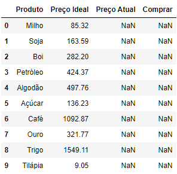
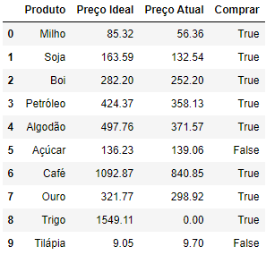

# Commodity Price Analysis
 
This small project aims to help a fictional importing company to decide the right 
timing to make a commodity purchase by analysing the current commodity price and the 
"ideal price" established by the company.

### Packages used:
+ selenium
+ pandas

## Importing the database

The information regarding which commodities should be analyzed and what are their 
respective "ideal prices" are contained within the company's database, so we need to
use the pandas package to extract that data.

https://github.com/Hugo-Hattori/Commodity_Price_Analysis/blob/70ec1101b6e438ddc7f3263d8b47bd275862b75e/Commodity_Price_Analysis.py#L5-L7

The simulated database is the "commodities.xlsx" file.

## Researching commodities prices

The next step is to research each commodity price, in this case we will be using the
"www.melhorcambio.com" website. By utilizing this website's addressing mechanic we can
search for the prices by just adding a String containing the commodity's name on the site's
hyperlink (e.g.: "https://www.melhorcambio.com/commodity_name")

https://github.com/Hugo-Hattori/Commodity_Price_Analysis/blob/70ec1101b6e438ddc7f3263d8b47bd275862b75e/Commodity_Price_Analysis.py#L9-L18

## Updating the database

Now we need to update the database and compare the current prices with the "ideal"
ones, if the current price is lower than the "ideal" than it is right time to make the
commodity purchase otherwise it is advised to wait.

https://github.com/Hugo-Hattori/Commodity_Price_Analysis/blob/70ec1101b6e438ddc7f3263d8b47bd275862b75e/Commodity_Price_Analysis.py#L20-L21
https://github.com/Hugo-Hattori/Commodity_Price_Analysis/blob/70ec1101b6e438ddc7f3263d8b47bd275862b75e/Commodity_Price_Analysis.py#L24-L28

The updated database was named "commodities_atualizado.xlsx".

Note: this is a project developed for academic purposes, therefore the
data contained in "commodities.xlsx" and "commodities_atualizado.xlsx" files are
fictitious and used only to learn Pandas and Selenium packages applications.
